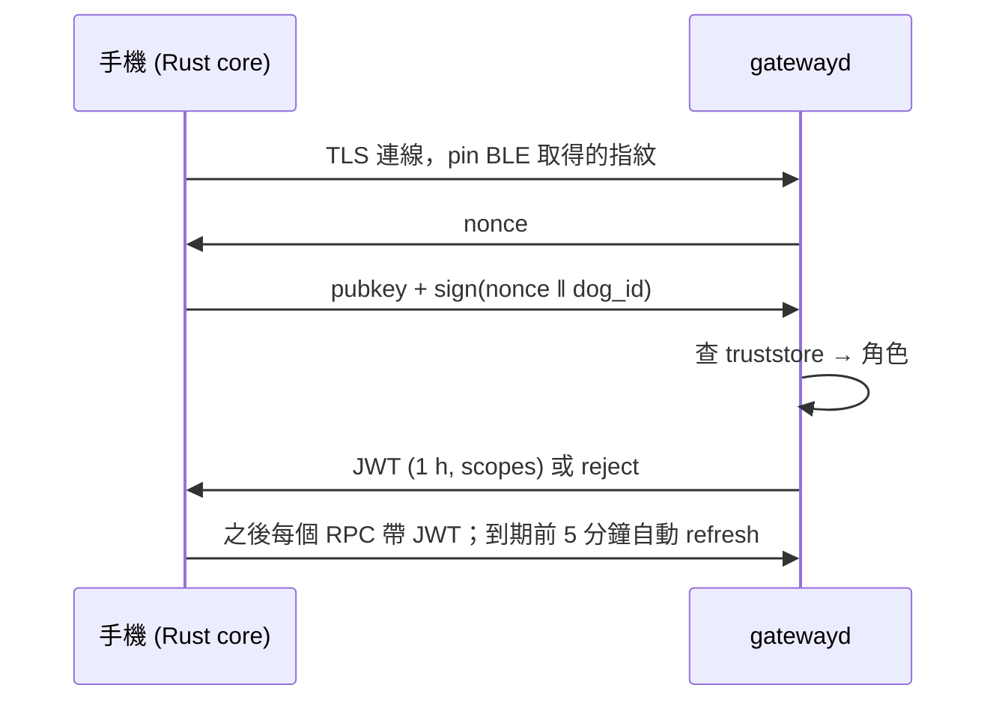
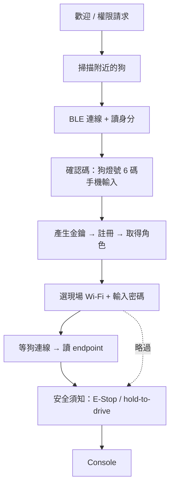
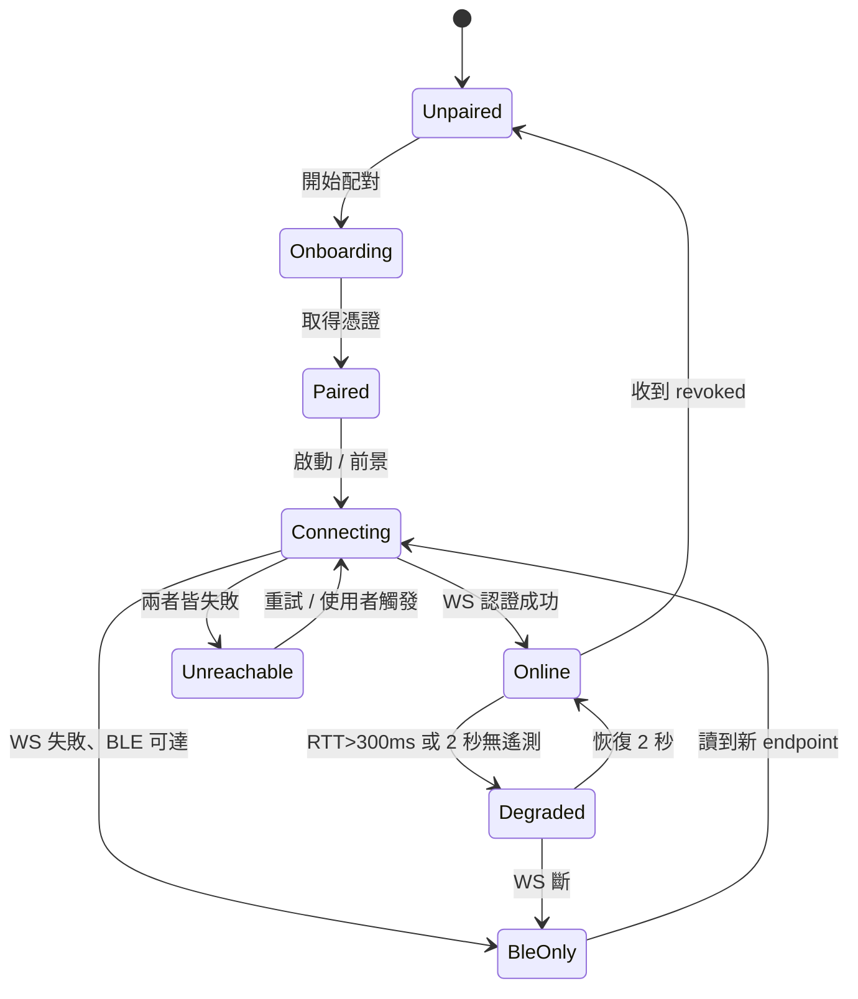

# SyncAI Quadruped Console — Client Spec v0.1

Sep 23, 2026 · @Paul

## 1. 目標與範圍

v1 是一支手機 App，讓保全人員在現場不經帳號登入，直接配對並操控一隻 SyncAI-Dog：看 3D 地圖、排任務、雙向通話、手動操控。Mock 版先做完整 UI 與狀態機，資料源全部假的，之後換接真 Gateway 不改 UI。

**v1 做**

- 手機直連（BLE 配對 → 區網 WS/WebRTC）
- 裝置配對授權：Owner / Operator / Viewer
- 3D 地圖、操控、任務排程、雙向通話、裝置管理五個功能區
- 首次連線 Onboarding 與重連
- Plugin 的 `mission_action` 擴充點

**v1 不做**

- 帳號登入、雲端 Portal、多狗管理（Portal 是另一個產品面）
- 遠端（非同區網）連線、TURN 中繼
- 錄影回放、事件搜尋
- Plugin 的 `map_layer` 與 `panel` 擴充點

**成功標準（Mock 階段）**：新使用者不看說明，3 分鐘內從開 App 走完 Onboarding 進到 Console；操控 tab 上手 30 秒內能讓假狗沿地圖走一圈。

## 2. 角色與權限

沒有帳號，信任單位是「一支手機的 Ed25519 公鑰」。狗端 bootstrapd 的 truststore 記錄公鑰 → 角色，Gateway 簽發的 JWT 帶 scopes，UI 依 scopes 顯示或鎖定功能。

| 角色 | 取得方式 | scopes | UI 差異 |
| --- | --- | --- | --- |
| Owner | 第一支完成配對的手機；同一隻狗只有一個 | 全部 + `admin` | 可撤銷其他手機、解除 E-Stop、安裝 plugin、改 Wi-Fi |
| Operator | Owner 在裝置頁核發，或狗處於配對模式時由 Owner 手機核准 | `view` `teleop` `mission.rw` `media.talk` | 無裝置管理；不能解除 E-Stop |
| Viewer | Owner 核發 | `view` | 地圖與影像唯讀；操控 / 任務 / 通話 tab 顯示鎖定態 |

規則：

- 任一角色都能按 E-Stop；只有 Owner 能解除
- 同時最多一個 `teleop` 持有者；後來者請求接手，前者 5 秒內未拒絕即轉移
- License 未涵蓋的功能（例如任務排程）對所有角色顯示鎖定態並註明原因，不隱藏
- Owner 手機遺失：狗上長按實體鍵 10 秒進入「重置配對」，清空 truststore；這是唯一的復原路徑，Onboarding 要明講

## 3. 連線與授權

兩條通道：BLE 對 bootstrapd 做配對與 provisioning，WS + WebRTC 對 Gateway 做一切運作。手機全程不切換 Wi-Fi。

| 通道 | 對端 | 何時用 | 內容 |
| --- | --- | --- | --- |
| BLE (GATT) | bootstrapd | 首次配對、狗無網路、Gateway 不健康、WS 斷線時的 E-Stop | 身分、ECDH、Wi-Fi 憑證、endpoint、健康度、ESTOP |
| WS (TLS, protobuf) | gatewayd | 連上區網後的全部運作 | 控制 50 Hz、遙測 20 Hz、RPC、事件、地圖分塊、signaling |
| WebRTC | gatewayd | 通話 tab 開啟時 | H.264 影像、Opus 雙向音訊 |

**GATT service（UUID 定義放 `SyncAI-Proto-Quadruped`）**

| Characteristic | 方向 | 內容 |
| --- | --- | --- |
| Dog Identity | read | 序號、公鑰指紋、韌體版本、是否已有 Owner |
| Pairing Challenge | write / notify | X25519 ECDH 交換 → 導出 session key |
| Phone Enrollment | write / notify | 手機 Ed25519 公鑰 + 請求角色 → 狗回憑證或拒絕 |
| Wi-Fi Credentials | write | SSID + 密碼，以 session key AES-GCM 加密 |
| Wi-Fi Status | notify | `connecting` `connected` `auth_failed` `not_found` |
| Network Endpoint | read / notify | IP:port + Gateway TLS 憑證指紋 |
| Gateway Health | notify | `up` `degraded` `down` + 最近錯誤碼 |
| Control | write | `ESTOP`、`RESTART_GATEWAY`（後者需 Owner 憑證簽名） |

**認證序列（WS）**



TLS pinning 與 WS 連線由 Tauri Rust core 建立（webview 無法自訂憑證信任），幀透過 Tauri channel 轉給 JS。私鑰存 iOS Keychain / Android Keystore，不落地到 JS。

**重連**：App 啟動 → 讀上次 endpoint → TLS pin 比對 → 挑戰回應 → 直接進 Console，全程無 UI。3 秒內連不上 → 轉 BLE 掃描讀新 endpoint → 仍失敗才顯示「找不到狗」。

## 4. 首次連線 Onboarding

八個畫面，正常路徑 2 分鐘內走完；每一步都有明確的失敗分支與退路。



| 步驟 | 畫面內容 | 失敗分支 | 處置 |
| --- | --- | --- | --- |
| 1 歡迎 | 一句話說明 + 請求藍牙 / 麥克風 / 相機權限 | 使用者拒絕藍牙 | 停在此頁，說明沒有藍牙無法配對，提供設定連結 |
| 2 掃描 | 列出廣播中的狗（序號後 4 碼 + 訊號強度）；可掃狗身 QR 直接過濾 | 30 秒無結果 | 提示：確認狗開機、距離 5 m 內、狗是否在配對模式（燈號藍色慢閃） |
| 3 連線 | 進度指示 + 狗的序號 / 韌體版本 | BLE 連線失敗 | 自動重試 3 次，仍失敗回步驟 2 |
| 4 確認碼 | 顯示「請看狗背面燈號」示意圖 + 6 格輸入 | 輸錯 | 允許 3 次；超過則狗端中止此次配對，回步驟 2 |
| 5 註冊 | 自動進行，顯示取得的角色 | 狗已有 Owner，且 Owner 手機不在線 | 顯示「需要 Owner 核准」，提供 Owner 手機上的核准路徑；可退回只當 Viewer |
| 6 Wi-Fi | 預填手機目前 SSID，密碼手輸；可「略過，之後再設」 | `auth_failed` / `not_found` | 留在此頁重輸；連續失敗 2 次提示略過 |
| 7 等待 | 進度 + 狗端 Wi-Fi 狀態即時回報（最長 30 秒） | 超時 | 回步驟 6；或略過改用 SoftAP 備援（v1 Mock 不做 SoftAP，只留入口） |
| 8 安全須知 | 三張卡：E-Stop 位置、放手即停、Owner 遺失復原方式；每張需勾選 | — | 不可略過 |

**略過 Wi-Fi 的後果**要在步驟 6 明講：只剩 BLE 通道，Console 只有裝置頁與 E-Stop 可用。

**第二支手機加入**：同流程，但步驟 5 走 Owner 核准。Owner 手機若在線，收到推播式對話框「序號 xxxx 的手機請求加入為 Operator」；不在線則新手機顯示等待並可取消。

**Owner 重置**：不在 App 內；狗上長按實體鍵 10 秒，燈號紅色快閃 3 秒後清空。App 偵測到 Dog Identity 的 `has_owner=false` 且本機憑證無效時，提示「這隻狗已被重置，重新配對」。

## 5. 資訊架構

單一主畫面：3D 地圖佈滿視口，功能以底部 sheet 切換，E-Stop 固定在地圖與 sheet 之間、永遠可見。手機直式為主，橫式只在通話與操控 tab 支援。

```
┌─ 狀態列（可點展開）──────────────────────────┐
│ ⚡78%  ▂▄▆ 42ms  [巡邏中]  ● Owner            │
├──────────────────────────────────────────────┤
│                                              │
│               3D 地圖（主視口）                │
│   點雲 · 狗位姿 · 航點 · 圍欄 · 相機錐         │
│                                              │
│  [跟隨] [2.5D] [圖層]            右側浮動鈕    │
├──────────────────────────────────────────────┤
│ ▐▌▐▌▐▌▐▌▐▌▐▌  E-STOP（全寬紅鍵）▐▌▐▌▐▌▐▌▐▌▐▌  │
├──────────────────────────────────────────────┤
│ 操控 │ 任務 │ 通話 │ 裝置        ← sheet tabs │
│ （sheet 內容：三段高度 20% / 50% / 90%）        │
└──────────────────────────────────────────────┘
```

**狀態列**：電量（含預估剩餘分鐘）、連線品質（RTT 分三級色）、狗狀態機當前態、我的角色。點擊展開：連線細節（通道、IP、JWT 到期）、小腦與 Gateway 版本、最近 5 條系統事件。

**Sheet 三段高度**：20% 只露 tab 列與一行摘要（地圖最大）；50% 是各 tab 的主要操作面；90% 用於任務編輯與裝置設定。操控 tab 鎖定在 50%，避免誤拖。

**E-Stop**：全寬、高 56 pt、紅底白字，任何 tab 任何 sheet 高度都不被遮蓋。單擊觸發，無二次確認（保全場景速度優先）；觸發後整條變為「已緊急停止 · 由 Owner 解除」，解除需長按 2 秒。WS 斷線時，E-Stop 改走 BLE，按鍵顯示藍牙圖示提示路徑改變。

**導覽原則**：沒有巢狀頁面。任務編輯、裝置設定都在 sheet 90% 內完成，返回是下拉 sheet 而非 back。唯一的全螢幕例外是通話 tab 橫式與 Onboarding。

**鎖定態**：scope 或 License 不足的 tab 不隱藏，顯示灰底 + 鎖圖示 + 一行原因（「需要 Operator 權限」/「任務排程未授權」）。

## 6. 功能規格 — 3D 地圖

地圖是狗當前世界的即時視圖，也是任務編輯的畫布。資料來自 navd 的 octree，Gateway 依相機視錐分塊推送 LOD。

**圖層**

| 圖層 | 來源 | 更新 | 預設 |
| --- | --- | --- | --- |
| 點雲 | `MAP` channel，0.05 m voxel，手機端上限 400k 點 | 首次全量 3–8 MB，之後 1 Hz 增量 | 開 |
| 佔據柵格（2.5D） | 同上導出 | 同上 | 低階裝置預設；可手動切 |
| 狗位姿 | `TELEMETRY` 20 Hz，客端內插到 60 fps | 即時 | 開 |
| 軌跡（近 60 秒） | 客端由位姿累積 | 即時 | 開 |
| 航點與路線 | mission store | 編輯時 | 任務 tab 開啟時 |
| 地理圍欄 | mission store | 編輯時 | 開 |
| 相機視錐 | 位姿 + 相機外參 | 即時 | 通話 tab 開啟時 |
| Plugin overlay | `PLUGIN` channel | plugin 決定 | v1 不做 |

**視角**

- 自由：單指旋轉、雙指縮放平移、雙擊重置
- 跟隨：相機鎖在狗後上方 3 m，可調高度；操控 tab 開啟時自動進入
- 第一人稱：點狗切換，與通話影像可並排（橫式）
- 俯視 2.5D：任務排程預設視角

**互動**

- 長按空地 0.5 秒 → 放航點（任務 tab 需開啟），航點吸附到最近可通行 voxel
- 拖曳航點移動；點航點開節點動作選單
- 圍欄：三點以上多邊形，頂點可拖曳；狗位姿在圍欄外時整個圍欄變紅並發事件
- 點地圖任一點顯示與狗的直線距離

**效能規則**

- 首幀在點雲載入 20% 時就渲染，其餘漸進補入
- 手機記憶體壓力事件觸發 → 自動降到 2.5D
- 點雲 shader 用 `gl.POINTS` + 距離衰減大小；不做逐點光照
- 目標：iPhone 12 / Pixel 6 等級維持 60 fps，點雲全載後 30 fps 以上

**空狀態**：狗尚未建圖時顯示網格地面 + 狗位姿 + 提示「移動狗以開始建圖」。

## 7. 功能規格 — 操控

操控是最高風險的功能：所有設計以「放手即停、斷線即停、看不清就不能動」為前提。需要 `teleop` scope。

**版面（sheet 50%，鎖定高度）**

```
┌──────────────────────────────────────────┐
│ RTT 42 ms ●   速度上限 ━━━●━━ 0.8 m/s     │
│                                          │
│   ┌─────┐                    ┌─────┐     │
│   │  ✛  │  左：前後左右移動     │  ✛  │ 右：轉向 · 俯仰
│   └─────┘                    └─────┘     │
│                                          │
│  [站立] [坐下] [趴下] [恢復]   步態 ▾       │
└──────────────────────────────────────────┘
```

**搖桿**

- 左：`vx`（前後）`vy`（左右平移）；右：`wz`（轉向）與相機俯仰（跟隨視角時）
- 死區 8%，輸出經 easing 曲線（低速段細、高速段粗）
- 觸控放開即歸零；不支援「鎖定前進」
- 送出頻率 50 Hz，每包帶 `seq` 與手機單調時間戳；搖桿無變化時仍送（心跳）

**Dead-man 兩級**

| 層 | 條件 | 動作 |
| --- | --- | --- |
| 手機端 | 手指離開搖桿 | 立即送零速並持續 50 Hz 送零速 |
| Gateway | 200 ms 未收到 CONTROL | 零速 |
| motion-bridge | 100 ms 未收 Gateway 心跳 | 零速 → 3 秒後趴下 |

**RTT 鎖定**

- RTT 由遙測帶回的 `last_control_seq` 計算，每秒更新
- < 150 ms 綠；150–300 ms 黃並自動把速度上限壓到 0.5 m/s；> 300 ms 紅，搖桿禁用（灰化 + 「訊號不足」），E-Stop 仍可用
- 連續 2 秒回到綠才解鎖，避免抖動

**姿態與步態**

- 姿態鍵是 RPC（非串流），成功前按鍵顯示進行中；狗在移動中時姿態鍵禁用
- 步態下拉：`walk` `trot` `stairs`（依小腦 SDK 能力表動態列出）；換步態需狗靜止
- 速度上限滑桿：0.2–1.5 m/s，Owner 可在裝置頁設定全域上限，Operator 只能在上限內調

**接手與搶佔**

- 任務執行中打開操控 tab → 提示「將暫停巡邏任務」，確認後任務進入 `paused`，操控結束 10 秒無輸入詢問是否恢復任務
- 另一支手機持有 teleop 時 → 顯示持有者角色，提供「請求接手」

**觸覺回饋**：進入紅區、E-Stop、姿態完成各一種震動模式。

## 8. 功能規格 — 任務排程

任務 = 路線 + 節點動作 + 觸發條件。任務資料存在狗上（Gateway sqlite），手機只是編輯器與檢視器，離線時唯讀顯示快取。需要 `mission.rw` 與任務 License。

**資料模型**

```
Mission {
  id, name, enabled,
  route: Waypoint[] { pose, tolerance_m, actions: Action[] }
  trigger: Once{at} | Cron{expr, tz} | Event{type, filter}
  policy: { on_low_battery: return_to_dock | pause, on_obstacle: reroute | wait{sec} | abort,
            allow_teleop_preempt: bool }
  return_to_dock: bool
}
Action = Wait{sec} | Snapshot{camera} | ThermalScan | Announce{clip_id} | Plugin{plugin_id, params}
Run { mission_id, started_at, state, current_wp_idx, events[], artifacts[] }
```

**Sheet 50%：任務列表**

- 每列：名稱、下次觸發時間、上次結果（成功 / 中止 / 失敗）、啟用開關
- 頂部：「進行中」卡片（若有），顯示進度 3/8、目前航點、預估剩餘、暫停 / 中止鍵
- 底部：「＋新任務」；空狀態引導「在地圖長按放第一個航點」

**Sheet 90%：任務編輯器**

1. 基本：名稱、啟用
2. 路線：航點列表（可拖曳排序），與地圖雙向連動——選列表項地圖聚焦，地圖選點列表捲動；每個航點展開節點動作
3. 觸發：三選一分段控制；Cron 用視覺化選擇器（每日 / 每週 / 自訂間隔），進階才露 cron 字串
4. 策略：低電量、遇障礙、允許操控搶佔
5. 儲存前驗證：航點可達性（RPC 問 navd）、與其他任務時間重疊、預估耗電 vs 充電時段

**衝突偵測**（儲存時 + 列表上標示）

| 衝突 | 顯示 | 可否儲存 |
| --- | --- | --- |
| 時間與其他任務重疊 | 黃色，列出對方任務 | 可，後排序者延後 |
| 預估耗電超過當時電量 | 黃色 | 可，警告 |
| 航點不可達 | 紅色，地圖上該航點紅 | 否 |
| 航點在圍欄外 | 紅色 | 否 |

**執行中視圖**：地圖高亮目前航點與剩餘路線；已完成航點打勾；每個 Snapshot 動作完成後在航點旁顯示縮圖，點開全螢幕。

**歷史**（任務詳情內）：最近 20 次 Run，時間線顯示每航點到達時間與動作結果；失敗 Run 顯示中止原因與當時位姿。

**Plugin 動作**：`Plugin{...}` 的參數表單由 plugin manifest 的 JSON Schema 生成，見第 11 節。

## 9. 功能規格 — 雙向通話

看狗看到的、對現場說話、聽現場聲音。WebRTC，signaling 走 WS，區網內不用 STUN/TURN。需要 `media.talk`（純看影像只需 `view`）。

**版面**

- 直式 sheet 50%：影像 16:9 佈滿 sheet 上半，下方一排控制鍵
- 直式 sheet 90% / 橫式：影像全螢幕，控制鍵浮在底部，地圖縮成右下角小視窗（可點對調）
- 通話中切到其他 tab，影像縮成畫中畫浮在地圖右上，音訊持續

**控制鍵**

| 鍵 | 行為 |
| --- | --- |
| 麥克風 | 全雙工開關；預設關（進 tab 不自動開麥） |
| 按住說話 | 長按期間開麥，放開關；與全雙工互斥，設定中可設為預設 |
| 喇叭 | 狗端聲音播放到手機，預設開 |
| 熱像疊加 | 疊 thermal 幀，透明度滑桿 0–100% |
| 相機切換 | 前 / 後（若有） |
| 快照 | 存目前幀到手機相簿 + 狗端 artifacts |
| 廣播 | 選預錄音檔（「此區域禁止進入」等）從狗喇叭播放；Owner 可在裝置頁上傳 |

**媒體參數**

- 影像：主流 720p30 H.264，Gateway 依 WebRTC 頻寬估測自動切 360p15 備援；手機顯示目前解析度
- 音訊：Opus 48 kHz，回聲消除開；狗端麥克風有風噪抑制標記時顯示
- 延遲目標：影像 glass-to-glass < 400 ms；音訊 < 250 ms。超過 800 ms 顯示「延遲高」

**與操控並用**：通話 tab 開啟時進操控 tab，影像自動成畫中畫，搖桿照常；這是巡檢時的主要模式，要在第一版就順。

**權限**：首次進 tab 才請求麥克風權限；拒絕時影像仍可看，麥克風鍵顯示禁用與設定連結。

**Mock**：影像用手機前鏡頭 `getUserMedia` 自播，麥克風做本地迴放；熱像用假的偽色噪聲層。

## 10. 功能規格 — 裝置頁

裝置頁是唯一在 WS 斷線時仍有內容的 tab，因為它的核心資料可以走 BLE。Owner 看到全部，Operator / Viewer 只看唯讀狀態。

| 區塊 | 內容 | 資料來源 | Owner 操作 |
| --- | --- | --- | --- |
| 這隻狗 | 名稱（可改）、序號、小腦 / Gateway / App 版本、運行時間 | WS，斷線時 BLE Identity | 改名 |
| 健康 | Gateway `up/degraded/down`、各服務狀態（navd、mediad、perceptiond）、CPU / 溫度 / 儲存 | WS 遙測；斷線時 BLE Gateway Health | 重啟 Gateway（BLE 簽名指令，需長按確認） |
| 已配對手機 | 列表：暱稱、角色、最後連線時間、是否在線 | WS RPC | 改角色、撤銷；核准待加入的手機 |
| 網路 | 目前 SSID、IP、訊號；SoftAP 備援開關（v1 只留 UI） | WS；斷線時 BLE | 換 Wi-Fi（走 BLE Wi-Fi Credentials） |
| 安全 | 全域速度上限、圍欄外行為、E-Stop 後自動趴下秒數 | WS | 修改 |
| License | 功能清單與授權狀態（地圖 / 任務 / AI 辨識 / 通話）、到期日 | WS；斷線顯示快取 | 匯入 License 檔（v1 只留入口） |
| Plugins | 已安裝清單、版本、啟用開關、要求的 capabilities | WS | 上傳 / 啟停 / 移除 |
| 廣播音檔 | 預錄音檔清單 | WS | 上傳 / 刪除 |
| 診斷 | 最近 200 條系統事件、匯出日誌 | WS | 匯出（分享 sheet） |
| 本機 | 清除本機配對資料（會退回 Onboarding）、App 版本 | 本機 | — |

**撤銷手機**：立即生效，對方 WS 連線被 Gateway 關閉並收到 `revoked` 事件，退回「找不到狗」畫面並清除本機憑證。

**重啟 Gateway**：唯一走 BLE 的寫入操作（連線正常時仍走 BLE，避免 WS 自己把自己關掉的競態）。重啟中裝置頁顯示倒數，其他 tab 鎖定。

**Owner 轉移**：v1 不做。Owner 換手機只能走狗上實體重置。

## 11. Plugin UI 擴充點

v1 只做 `mission_action`：plugin 以 JSON Schema 宣告參數，Console 用 schema-driven 表單渲染，不執行任何 plugin 提供的程式碼。`map_layer` 與 `panel` 留介面定義，v2 實作。

**Manifest 的 UI 貢獻段**

```toml
[[ui.mission_action]]
id = "gas.sample"
label = { zh-TW = "氣體採樣", en = "Gas sample" }
icon = "flask"
schema = "schemas/gas_sample.json"   # JSON Schema draft 2020-12
requires = ["sensor.gas"]             # 缺少時動作選單顯示鎖定
estimate_sec = 15                     # 排程耗時估算用
```

**表單渲染器支援的 schema 子集**：`string`（含 `enum`、`format: time`）、`number` / `integer`（`minimum` `maximum` → 滑桿或步進器）、`boolean`、單層 `object`、`array of string`。超出子集的欄位顯示「此 plugin 需要更新的 App」而非崩潰。

**顯示位置**：航點的節點動作選單，內建動作之後，以 plugin 名稱分組。任務執行時，plugin 動作的結果（plugin 回傳的 `summary` 字串 + 可選 artifact）顯示方式與內建動作一致。

**信任邊界**：Console 只讀 manifest 的宣告欄位；schema 中的 `title` / `description` 視為純文字，不渲染 markdown 或 HTML。plugin 的安裝與驗簽在狗端完成，Console 只顯示結果。

**v2 預留**：`map_layer`（GeoJSON-like 幾何 + 樣式，經 `PLUGIN` channel 推送）、`panel`（獨立 tab，schema-driven 唯讀 dashboard）。

## 12. Client 內部架構

UI 只依賴 `DogLink` 介面，不知道底下是 Mock 還是真狗。Rust core 只做 webview 做不到的三件事：BLE、金鑰保管、TLS pinning。

```
src-tauri/  (Rust)
  ble/        blec 封裝 → 高階命令：scan, pair, provision_wifi, read_endpoint, estop
  keystore/   Ed25519 keypair 存 Keychain / Keystore；sign(nonce)
  link/       tokio-tungstenite + rustls，pin 指紋；幀經 tauri::ipc::Channel 推 JS
  commands.rs 暴露上述為 #[tauri::command]

src/  (Next.js, output: 'export')
  proto/      buf 生成的 TS 型別（來自 SyncAI-Proto-Quadruped）
  link/
    DogLink.ts        介面
    BleLink.ts        呼叫 Tauri commands
    GatewayLink.ts    WS 封包編解碼、seq、心跳、RPC promise 對應
    MediaLink.ts      RTCPeerConnection，signaling 經 GatewayLink
    mock/             MockBleLink · MockGatewayLink · MockMediaLink · scenarios/
  store/      zustand slices：connection · robot · map · missions · session · ui
  map3d/      react-three-fiber：PointCloud · RobotModel · Waypoints · Fence · Camera rigs
  screens/    onboarding/* · console/* · device/*
  components/ Joystick · EStopBar · BottomSheet · SchemaForm · StatusBar
  plugins/    SchemaForm renderer、manifest 型別
```

**DogLink 介面（節錄）**

```ts
interface DogLink {
  ble: {
    scan(): AsyncIterable<DogAdvert>
    pair(dogId): Promise<PairSession>          // 進 ECDH，回傳需要確認碼的 session
    confirm(session, code6): Promise<Enrollment>
    provisionWifi(ssid, psk): AsyncIterable<WifiStatus>
    readEndpoint(): Promise<Endpoint>
    estop(): Promise<void>
    health(): AsyncIterable<GatewayHealth>
  }
  gateway: {
    connect(endpoint): Promise<Session>        // 含挑戰回應
    control: Sink<ControlFrame>                 // 50 Hz
    telemetry: Stream<TelemetryFrame>           // 20 Hz
    events: Stream<Event>
    map: Stream<MapChunk>
    rpc<T extends RpcName>(name: T, req): Promise<RpcRes<T>>
  }
  media: {
    open(opts): Promise<MediaSession>
    close(): Promise<void>
  }
}
```

**Store 原則**

- `robot` slice 是狗狀態機的鏡射，只由 telemetry / events 寫入，UI 不直接改
- `connection` slice 是 Client 自己的連線狀態機（第 13 節）
- `missions` 以 Gateway 為真相，本機只有樂觀更新與離線快取（IndexedDB）
- 位姿內插在 `map3d` 內部做，不進 store，避免 60 fps 寫入觸發重繪

**Mock 注入**：`NEXT_PUBLIC_LINK=mock` 時 `createDogLink()` 回傳 mock 實作；場景由 `?scenario=` query 或裝置頁隱藏開發選單切換。Mock 與真實實作共用 proto 型別，介面漂移由 TypeScript 編譯期擋住。

## 13. 狀態機與錯誤處理

兩個狀態機：Client 自己的連線狀態、狗狀態的鏡射。UI 的每個畫面都是這兩者的函數，不允許 UI 自己維護第三份狀態。

**連線狀態機（Client）**



| 狀態 | 地圖 | E-Stop | 操控 / 任務 / 通話 | 裝置頁 |
| --- | --- | --- | --- | --- |
| Online | 即時 | WS | 依 scope | 全部 |
| Degraded | 即時但標示 | WS | 操控鎖、其餘可用 | 全部 |
| BleOnly | 最後快取 + 灰化 | BLE | 全鎖 | 健康 / 網路 / 重啟 |
| Unreachable | 最後快取 + 灰化 | 禁用 | 全鎖 | 本機 |

**狗狀態鏡射**：`BOOT` `IDLE` `TELEOP` `MISSION` `PAUSED` `CHARGING` `ESTOP` `FAULT`，由遙測的 `mode` 欄位驅動。Client 對狀態的反應：

- `ESTOP`：E-Stop 條變為解除模式；地圖狗模型變紅；操控 tab 顯示原因（誰觸發、何時）
- `FAULT`：全螢幕 banner 顯示錯誤碼與建議（來自 Gateway 的錯誤字典）；只保留裝置頁與 E-Stop
- `CHARGING`：操控 tab 提示「充電中，操控將中斷充電」需確認
- `MISSION` → `PAUSED`（被操控搶佔）：任務卡片顯示暫停原因與恢復鍵

**錯誤呈現層級**

| 層級 | 形式 | 例 |
| --- | --- | --- |
| 行內 | 欄位下紅字 | 航點不可達、Wi-Fi 密碼錯 |
| Toast | 3 秒自動消失，可點展開 | RPC 逾時、快照失敗 |
| Banner | 停留直到狀態改變 | Degraded、License 到期 7 天內 |
| 全螢幕 | 阻擋操作 | FAULT、revoked、Unreachable 超過 30 秒 |

**前景 / 背景**：App 進背景 5 秒後主動關 WS 與 WebRTC（省電、避免 iOS 殺連線造成的假在線）；回前景走 `Connecting`。背景期間不維持操控——這是安全決策，不是省電決策。

**時鐘**：所有顯示時間用狗的時鐘（遙測帶 `dog_time`），手機只做偏移校正；避免手機時區或時間錯誤影響任務排程顯示。

## 14. 非功能需求

| 類別 | 需求 | 驗證方式 |
| --- | --- | --- |
| 效能 | 冷啟動到 Console < 2 秒（已配對）；地圖首幀 < 1 秒；點雲全載後 ≥ 30 fps；搖桿觸控到送包 < 20 ms | Mock 場景 `perf`，錄 Xcode Instruments / Perfetto |
| 頻寬 | 不含影像 < 300 kbps；含 720p 影像 < 3.5 Mbps；弱訊號自動降 360p | Mock 場景 `weak_signal` |
| 安全 | 私鑰不離開 Keychain / Keystore；TLS pin 失敗即斷不降級；JWT 不落地到 localStorage（記憶體 + Keychain refresh token）；所有 plugin 文字純文字渲染 | Code review checklist；Mock 場景 `pin_mismatch` |
| 可靠性 | 任一 tab 崩潰不影響 E-Stop（E-Stop 在獨立 React error boundary 之外）；WS 斷線 500 ms 內 UI 反映 | 故意在 tab 內丟例外測 |
| 相容 | iOS 16+、Android 10+（API 29）；WebGL2；最低 iPhone 11 / Pixel 5 | 實機矩陣 |
| 可存取性 | 所有可點元件 ≥ 44 pt；E-Stop 有 VoiceOver / TalkBack 標籤與 haptic；不以顏色為唯一資訊載體（RTT 三級同時有文字） | 手動檢查 |
| 國際化 | zh-TW 預設、en 第二；所有字串經 i18n；日期時間用狗時鐘 + 手機地區格式 | 切語言跑一遍 |
| 電量 | 通話 + 地圖同開 1 小時耗電 < 25%；背景 5 秒關連線 | 實機測 |
| 日誌 | Client 本機環形日誌 5 MB，含連線事件、RPC 錯誤、狀態轉換；裝置頁可匯出 | — |

**不做的非功能項**：離線任務編輯（v1 離線唯讀）、崩潰自動上報（無雲端）、多語音包。

## 15. Mock 範圍與場景

Mock 假的是資料源，真的是狀態機與 UI。三個 Mock 實作各自模擬一條通道，場景切換整套注入。

**MockBleLink**

- 假狗清單（2 隻：一隻無 Owner、一隻已有 Owner）
- 配對：任何 6 碼 `123456` 通過，其他失敗；可設定「Owner 不在線」
- Wi-Fi：SSID 含 `fail` → `auth_failed`；`slow` → 25 秒後才 connected

**MockGatewayLink**

- 遙測產生器：位姿沿預錄路線走（可被操控輸入覆寫），電量每分鐘降 0.5%，RTT 依場景
- 靜態點雲：一份 200k 點的辦公室樓層 `.ply`（要自己錄或用公開資料集裁切）；增量以隨機抽樣模擬
- 任務：記憶體內 store，排程器真的跑（setInterval），觸發時假狗開始沿路線走
- 事件：每 30–90 秒隨機一條 perception 事件
- 所有 RPC 延遟 50–150 ms 隨機

**MockMediaLink**：前鏡頭自播、本地音訊迴放、假熱像層。

**場景**（`?scenario=` 或裝置頁隱藏選單）

| 場景 | 行為 | 驗證什麼 |
| --- | --- | --- |
| `default` | 全綠 | 主流程 |
| `weak_signal` | RTT 在 100–500 ms 震盪 | 操控鎖定、Degraded banner、影像降級 |
| `low_battery` | 電量 12% 且下降快 | 任務衝突警告、充電狀態 |
| `estop_remote` | 30 秒後由「另一支手機」觸發 E-Stop | ESTOP 鏡射、解除流程 |
| `gateway_down` | 45 秒後 WS 斷、BLE Health 回 `down` | BleOnly、重啟 Gateway 流程 |
| `revoked` | 60 秒後收 `revoked` | 退回 Unpaired |
| `no_license` | 任務 License 未授權 | 鎖定態 |
| `viewer` | 角色 Viewer | scope 鎖定 |
| `fault` | 小腦回 FAULT 0x42 | 全螢幕錯誤 |
| `perf` | 點雲 400k、遙測 50 Hz | fps 與記憶體 |

**Mock 不做**：真 BLE、真 WS、真 WebRTC 對端、SoftAP。

**Mock 交付物**：可在瀏覽器跑（`next dev` + mock link，方便設計審查），也可包成 Tauri 裝到手機（驗手勢與效能）。

## 16. 技術棧與專案結構

| 層 | 選擇 | 理由 / 備註 |
| --- | --- | --- |
| 殼 | Tauri 2（iOS + Android + desktop） | 同一份碼可在筆電當調機工具 |
| 前端 | Next.js 15，`output: 'export'`，App Router | 無 SSR / API routes / middleware；`images.unoptimized` |
| UI | Tailwind + 對齊 OrchestrationDashboard 的 design tokens（待取得） | 先抽成 `tokens.css`，兩個 repo 共用 |
| 3D | three.js + react-three-fiber + drei | 點雲自訂 shader；不用 postprocessing |
| 狀態 | zustand（slice 模式） | 輕、無 provider 樹 |
| 表單 | react-hook-form + 自寫 SchemaForm | JSON Schema 子集渲染 |
| 協定 | protobuf（buf 生 TS 與 Rust） | 來自 `SyncAI-Proto-Quadruped` |
| BLE | tauri-plugin-blec（社群） | 出問題改自寫 plugin |
| 金鑰 | iOS Keychain / Android Keystore 經自寫 Tauri command | 不用第三方 plugin |
| WS | Rust：tokio-tungstenite + rustls（pinning） | JS 端 WebSocket 不可自訂憑證 |
| WebRTC | 瀏覽器原生 `RTCPeerConnection` | Android 需 MainActivity 權限橋接 |
| i18n | next-intl（靜態） | zh-TW / en |
| 測試 | Vitest（store、link 編解碼）+ Playwright（瀏覽器 mock 流程） | 手機 E2E 手動 |
| CI | GitHub Actions：lint、test、Tauri build iOS / Android | 簽章憑證後補 |

**Repo**：Mock 階段 `SyncAI-Mock-QuadrupedConsole`；接真 Gateway 後改名 `SyncAI-App-QuadrupedConsole`（保留歷史，不新開）。

**目錄**：見第 12 節。`proto/` 與 `tokens.css` 是 git submodule 或 npm workspace 引入，不複製。

**平台設定清單**

- iOS `Info.plist`：`NSBluetoothAlwaysUsageDescription` `NSMicrophoneUsageDescription` `NSCameraUsageDescription` `NSLocalNetworkUsageDescription`；Xcode 加 CoreBluetooth framework
- Android `AndroidManifest`：`BLUETOOTH_SCAN` `BLUETOOTH_CONNECT` `CAMERA` `RECORD_AUDIO` `MODIFY_AUDIO_SETTINGS` `INTERNET`；`MainActivity.kt` 覆寫 `onPermissionRequest` 橋接 WebView 權限
- Tauri `capabilities`：`blec:default` + 自訂 keystore / link 指令

## 17. 待決事項

- [ ] OrchestrationDashboard 的 design tokens / 截圖——沒有這個 UI 無法對齊
- [ ] 大腦板有無 BT 模組——決定 BLE 路線能否成立
- [ ] Provisioning 協定：自訂 GATT（本文）vs Improv Wi-Fi 標準
- [ ] 第一版地圖：真點雲 vs 先 2.5D——影響 Mock 的樣本資料準備
- [ ] 步態清單與小腦 SDK 能力表格式——操控 tab 的步態下拉依此動態生成
- [ ] 廣播音檔格式與長度上限
- [ ] 任務 License 的粒度：整個任務功能一個 License，還是排程 / 動作分開
- [ ] Owner 遺失復原：實體鍵長按是否可接受，或需要 License 檔簽名的重置指令
- [ ] 是否要在 Mock 階段就包 Tauri 上實機，或先純瀏覽器做完設計審查

**下一步**：確認前兩項後開 repo，先做 Onboarding + Console 骨架 + MockGatewayLink 的遙測與地圖，一週內可在瀏覽器走完主流程。
